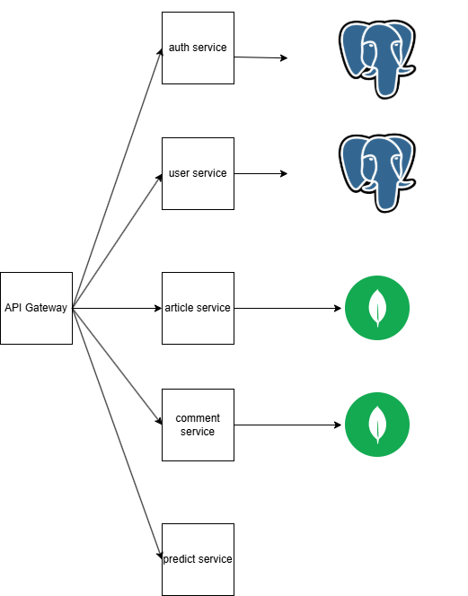
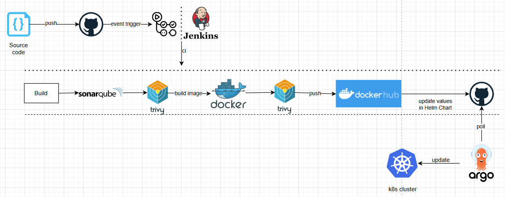
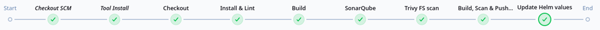
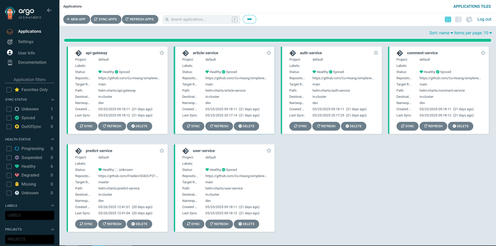
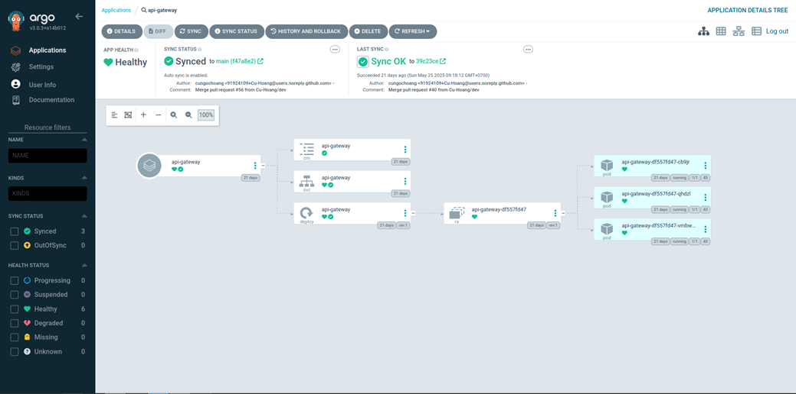

# simplenews

## Overview

A RESTful API application for news, providing authentication and role-based access control. The application follows a microservices architecture and applies a CI/CD pipeline to automate the build and deployment process.

## Technologies:

#### Frameworks: NestJS.

#### DevOps Tools: GitHub Actions, Jenkins, ArgoCD, Docker, Helm, Kubernetes(K3D).

#### Databases: PostgreSQL, MongoDB.

## Architecture:

    </img>

## CI/CD Pipeline:

    </img>

## Jenkins

    </img>

## ArgoCD

    </img>

    </img>

